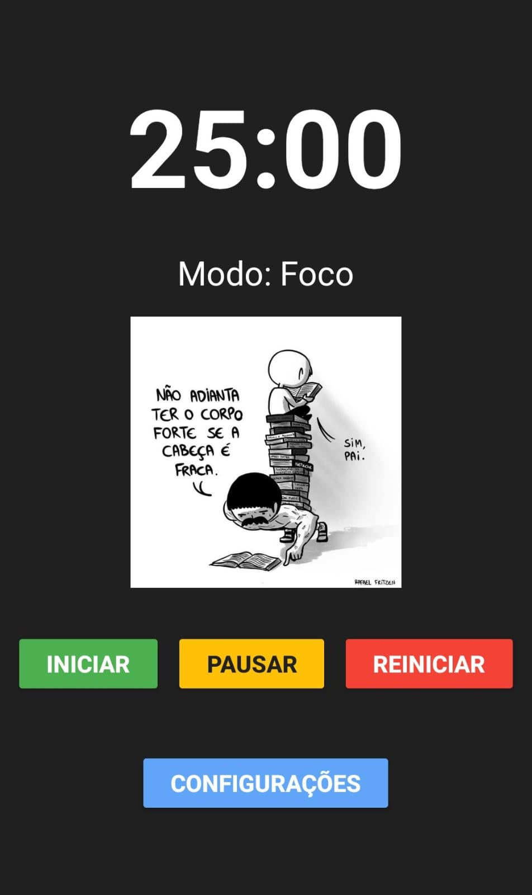

# 🍅 Cronômetro Pomodoro: Foco no que Importa! 🚀

<p align="center">
    
</p>

---

## ✨ Sobre o Projeto

O Cronômetro Pomodoro é um aplicativo simples e intuitivo para Android, focado em ajudar você a gerenciar seu tempo de estudo ou trabalho utilizando a aclamada **Técnica Pomodoro**. Com uma interface minimalista e recursos que garantem seu foco, ele é o companheiro perfeito para impulsionar sua produtividade! ⏰

---

### 🎬 Veja o Projeto em Ação!

Assista a uma breve demonstração do Cronômetro Pomodoro e suas funcionalidades.
[**Clique aqui para assistir ao vídeo de demonstração**](https://drive.google.com/file/d/1PgOBNFAmZYTKtV6_PhzLtNQOIkVQRROE/view?usp=sharing)

---

## 🎯 Funcionalidades

Seu novo aliado da produtividade vem com:

* **Contador Visual:** Um timer claro e vibrante para acompanhar seus 25 minutos de foco e 5 de descanso.
* **Modos de Sessão:** Alterna automaticamente entre "Modo: Foco" e "Modo: Descanso". 💡
* **Pausas Longas:** Após cada 4 ciclos de foco, desfrute de uma pausa mais longa (15 minutos) para recarregar as energias. ☕
* **Feedback Inteligente:**
  * **Vibração:** Sinta o fim da sessão com uma vibração discreta. 📱
  * **Alarme Sonoro:** Um som te avisa que é hora de trocar de atividade. 🔔
* **Conteúdo Dinâmico:**
  * **Imagens Rotativas:** Durante o "Modo: Foco", imagens inspiradoras de estudo e produtividade aparecem a cada 10 segundos. 📚✨
  * **Mensagens Motivacionais:** No "Modo: Descanso", receba dicas de relaxamento e lembretes para sua pausa a cada 7 segundos. 🧘‍♀️💧
* **Controles Simples:** Botões intuitivos para Iniciar ▶️, Pausar ⏸️ e Reiniciar 🔄.
* **Experiência Consistente:**
  * **Modo Escuro Fixo:** Um tema escuro elegante e confortável para os olhos em qualquer ambiente. 🌙
  * **Orientação Travada:** Mantenha o foco sem interrupções, pois a tela permanece na orientação vertical. 🔒
* **Sessões Flexíveis:**
  * **Pausar e Continuar:** Pause o timer e continuar quando quiser, sem perder o progresso. ⏸️
  * **Reiniciar a Qualquer Momento:** Volte ao início do ciclo com facilidade. ↩️

---

## 🛠️ Tecnologias Utilizadas

Este projeto foi desenvolvido com as seguintes ferramentas e tecnologias:

* **Linguagem:** Kotlin ☕
* **Plataforma:** Android (Nativo) 🤖
* **Interface:** XML (Views Tradicionais) ✨
* **IDE:** Android Studio 💻
* **Sistema de Build:** Gradle (Kotlin DSL) ⚙️
* **Biblioteca de Imagens/GIFs:** Glide (v4.12.0) 🖼️

---

## 🚀 Como Rodar a Aplicação

Siga estes passos para ter o Cronômetro Pomodoro rodando no seu dispositivo:

1. **Clone o Repositório:**

    ```bash
    git clone https://github.com/CarlosRyan07/PomodoroTimer.git
    cd PomodoroTimer # Ou o nome da pasta do seu projeto
    ```

2. **Abra no Android Studio:**
    * No Android Studio, selecione `File` > `Open...` e navegue até a pasta raiz do projeto que você clonou.
3. **Sincronize o Gradle:**
    * O Android Studio deve sincronizar automaticamente as dependências do Gradle. Caso contrário, clique no ícone do elefante (`Sync Project with Gradle Files`) na barra de ferramentas.
4. **Instale no Dispositivo:**
    (Eu optei por rodar dessa forma)
    * Conecte seu celular Android ao computador via USB.
    * Certifique-se de que a **Depuração USB** esteja ativada nas `Opções do Desenvolvedor` do seu celular.
    * Clique no botão **`Run 'app'`** (o ícone de 'Play' verde ▶️) na barra de ferramentas do Android Studio.
    * O aplicativo será instalado e executado no seu celular.

---

## 🧪 Testes

O projeto conta com alguns testes para garantir a robustez das funcionalidades principais:

* **Testes Unitários:** Verificam a lógica isolada de formatação de tempo e gerenciamento de ciclos Pomodoro.
  * **Como Rodar:** No Android Studio, navegue até `app/src/test/java/com/example/pomodorotimer/` e clique com o botão direito no arquivo `TimerUtilsTest.kt` e selecione `Run 'TimerUtilsTest'`.

---

## 💡 Melhorias Futuras (Ideias)

* **Tempos Customizáveis:** Permitir que o usuário defina seus próprios tempos de foco e descanso.
* **Notificações Avançadas:** Notificações persistentes ou com botões de ação (pausar/resetar/pular).
* **Sons Personalizados:** Opção de escolher sons de alarme diferentes.
* **Contagem de Ciclos:** Exibir visualmente o número de ciclos Pomodoro concluídos.
* **Estatísticas:** Registrar o tempo focado e as pausas ao longo do tempo.
* **Adaptação a Tablets/Chromebooks:** Criar layouts específicos para diferentes tamanhos de tela.

---

## 🤝 Contribuição

Contribuições são bem-vindas! Se você tiver sugestões, ideias ou quiser melhorar o código, sinta-se à vontade para abrir uma *issue* ou enviar um *pull request*.

---

## 📄 Licença

Este projeto está licenciado sob a Licença MIT.

---

## 👨‍💻 Autor

Feito com por: **Carlos Ryan**

---
