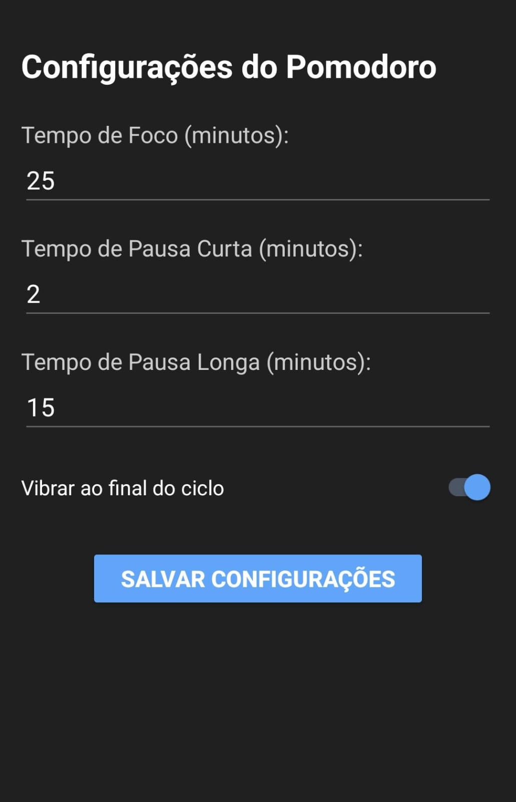

Markdown

# 🍅 Cronômetro Pomodoro: Foco no que Importa! 🚀

<p align="center">
    
</p>

---

## ✨ Sobre o Projeto

O Cronômetro Pomodoro é um aplicativo simples e intuitivo para Android, focado em ajudar você a gerenciar seu tempo de estudo ou trabalho utilizando a aclamada **Técnica Pomodoro**. Com uma interface minimalista e recursos que garantem seu foco, ele é o companheiro perfeito para impulsionar sua produtividade! ⏰

---

### 🎬 Veja o Projeto em Ação!

Assista a uma breve demonstração do Cronômetro Pomodoro e suas funcionalidades(Esta desatualizado pois no video ainda não havia aplicado a tela de configuração).
[**Clique aqui para assistir ao vídeo de demonstração**](https://drive.google.com/file/d/1PgOBNFAmZYTKtV6_PhzLtNQOIkVQRROE/view?usp=sharing)

---

## 🎯 Funcionalidades

Seu novo aliado da produtividade vem com:

* **Contador Visual:** Um timer claro e vibrante para acompanhar seus minutos de foco e descanso.

* **Modos de Sessão:** Alterna automaticamente entre "Modo: Foco" e "Modo: Descanso". 💡

* **Pausas Longas:** Após cada 4 ciclos de foco, desfrute de uma pausa mais longa (15 minutos) para recarregar as energias. ☕

* **Feedback Inteligente:**
    * **Vibração:** Sinta o fim da sessão com uma vibração discreta. 📱
    * **(Alarme Sonoro removido para uma experiência mais silenciosa e focada)**

* **Conteúdo Dinâmico:**
    * **Imagens Rotativas:** Durante o "Modo: Foco", imagens inspiradoras de estudo e produtividade aparecem a cada 10 segundos. 📚✨
    * **Mensagens Motivacionais:** No "Modo: Descanso", receba dicas de relaxamento e lembretes para sua pausa a cada 7 segundos. 🧘‍♀️💧
    * **Interatividade ao Toque:** Avance as imagens e mensagens de foco/descanso com um simples toque na tela, a qualquer momento, independentemente do estado do contador. ✨

* **Controles Simples:** Botões intuitivos para Iniciar ▶️, Pausar ⏸️ e Reiniciar 🔄.

* **Experiência Consistente:**
    * **Modo Escuro Fixo:** Um tema escuro elegante e confortável para os olhos em qualquer ambiente. 🌙
    * **Orientação Travada:** Mantenha o foco sem interrupções, pois a tela permanece na orientação vertical. 🔒

* **Sessões Flexíveis:**
    * **Pausar e Continuar:** Pause o timer e continuar quando quiser, sem perder o progresso. ⏸️
    * **Reiniciar a Qualquer Momento:** Volte ao início do ciclo com facilidade. ↩️

* **Configurações Personalizáveis:**
    * **Tempos Ajustáveis:** Acesse uma tela dedicada para definir seus próprios tempos para o foco, pausa curta e pausa longa. O contador principal se adapta instantaneamente às suas preferências. ⚙️
    * **Controle de Vibração:** Ative ou desative a vibração ao final dos ciclos.

    <p align="center">
    
    </p>

---

## 🛠️ Tecnologias Utilizadas

Este projeto foi desenvolvido com as seguintes ferramentas e tecnologias:

* **Linguagem:** Kotlin ☕
* **Plataforma:** Android (Nativo) 🤖
* **Interface:** XML (Views Tradicionais) ✨
* **IDE:** Android Studio 💻
* **Sistema de Build:** Gradle (Kotlin DSL) ⚙️
* **Biblioteca de Imagens/GIFs:** Glide (v4.12.0) 🖼️

---

## 🚀 Como Rodar a Aplicação

Siga estes passos para ter o Cronômetro Pomodoro rodando no seu dispositivo:

1.  **Clone o Repositório:**

    ```bash
    git clone [https://github.com/CarlosRyan07/PomodoroTimer.git](https://github.com/CarlosRyan07/PomodoroTimer.git)
    cd PomodoroTimer # Ou o nome da pasta do seu projeto
    ```

2.  **Abra no Android Studio:**
    * No Android Studio, selecione `File` > `Open...` e navegue até a pasta raiz do projeto que você clonou.
3.  **Sincronize o Gradle:**
    * O Android Studio deve sincronizar automaticamente as dependências do Gradle. Caso contrário, clique no ícone do elefante (`Sync Project with Gradle Files`) na barra de ferramentas.
4.  **Instale no Dispositivo:**
    (Eu optei por rodar dessa forma)
    * Conecte seu celular Android ao computador via USB.
    * Certifique-se de que a **Depuração USB** esteja ativada nas `Opções do Desenvolvedor` do seu celular.
    * Clique no botão **`Run 'app'`** (o ícone de 'Play' verde ▶️) na barra de ferramentas do Android Studio.
    * O aplicativo será instalado e executado no seu celular.

---

## 🧪 Testes

O projeto conta com alguns testes para garantir a robustez das funcionalidades principais:

* **Testes Unitários:** Verificam a lógica isolada de formatação de tempo e gerenciamento de ciclos Pomodoro.
    * **Como Rodar:** No Android Studio, navegue até `app/src/test/java/com.example.pomodorotimer/` e clique com o botão direito no arquivo `TimerUtilsTest.kt` e selecione `Run 'TimerUtilsTest'`.

---

## Como funciona o codigo

Esta seção detalha o funcionamento interno do aplicativo Pomodoro Timer, dividindo o código em partes lógicas para facilitar a compreensão de sua estrutura e comportamento.

### 1. Importações e Estrutura Principal (`MainActivity` e `SettingsActivity`)

Esta seção descreve as bibliotecas que o aplicativo utiliza e a estrutura fundamental das suas duas telas principais: `MainActivity` (a tela do cronômetro) e `SettingsActivity` (a tela de configurações).

* **Importações:** Permitem o uso de funcionalidades do Android (como `Button`, `TextView`, `CountDownTimer`, `Vibrator`, `SharedPreferences`) e de bibliotecas externas (como Glide para carregamento de imagens).

* **`MainActivity`:** É a classe principal que representa a tela do cronômetro Pomodoro. Ela gerencia a UI, a lógica do timer, a exibição de conteúdo dinâmico e a navegação para a tela de configurações.

* **`SettingsActivity`:** É a classe que representa a tela de configurações, onde o usuário pode personalizar os tempos do Pomodoro e se quer vibração ao completar o tempo.


### 2. Declaração de Variáveis (UI e Lógica do Timer)

Aqui você define todos os elementos visuais (Views) da tela e as variáveis que controlam o estado do timer e do aplicativo.

* **`lateinit var` para Views:** São componentes da interface que serão inicializados mais tarde, no método `onCreate()`.
* **Variáveis de Controle do Cronômetro:** Gerenciam o `CountDownTimer`, o tempo restante, se o timer está rodando e qual modo (foco/pausa) está ativo.
* **Tempos Padrão do Pomodoro:** Constantes para a duração de cada fase (foco, pausa curta, pausa longa).
* **Controle de Ciclos:** `pomodoroCycles` para acompanhar os ciclos de foco e determinar quando aplicar a pausa longa.

```kotlin
class MainActivity : AppCompatActivity() {

    // Declaração das Views (elementos da UI)
    private lateinit var timerDisplay: TextView
    private lateinit var startButton: Button
    private lateinit var pauseButton: Button
    private lateinit var resetButton: Button
    private lateinit var modeIndicator: TextView
    private lateinit var breakMessageDisplay: TextView
    private lateinit var animatedImageView: ImageView

    // Variáveis de controle do cronômetro
    private var countDownTimer: CountDownTimer? = null
    private var timeLeftInMillis: Long = 0L
    private var isRunning: Boolean = false

    // Tempos padrão do Pomodoro
    private val focusTime = 25 * 60 * 1000L
    private val breakTime = 5 * 60 * 1000L
    private val longBreakTime = 15 * 60 * 1000L

    private var isFocusMode: Boolean = true // Começa no modo foco
    private var pomodoroCycles: Int = 0

    // ... restante do código ...
}
```

### 3. Gerenciamento de Conteúdo Dinâmico (Imagens e Mensagens)

Esta parte define os recursos (imagens e mensagens) que mudam na tela e a lógica para a rotação automática deles.

* **Arrays de Recursos:** `focusImages`, `breakImages` (para GIFs/imagens) e `breakMessages` (para frases motivacionais/dicas).
* **Handler e Runnable:** São usados para agendar tarefas na thread principal (neste caso, a troca automática de imagens e mensagens) em intervalos regulares. `messageHandler` e `focusImageHandler` são os responsáveis por isso.

```kotlin
class MainActivity : AppCompatActivity() {
    // ... declarações anteriores ...

    // VARIÁVEIS E LÓGICA PARA AS MENSAGENS DE PAUSA
    private lateinit var breakMessages: Array<String>
    private var currentMessageIndex = 0
    private val messageHandler = Handler(Looper.getMainLooper())
    private val messageRunnable = object : Runnable {
        override fun run() {
            updateBreakMessage()
            messageHandler.postDelayed(this, 7000L) // Repete a cada 7 segundos
        }
    }

    // Arrays de recursos para imagens/GIFs (ATENÇÃO AOS NOMES DOS ARQUIVOS EM res/drawable/)
    private val focusImages = intArrayOf( /* ... seus drawables ... */ )
    private val breakImages = intArrayOf( /* ... seus drawables ... */ )
    private var currentBreakImageIndex = 0

    // VARIÁVEIS PARA A ROTAÇÃO DE IMAGENS NO MODO FOCO
    private var currentFocusImageIndex = 0
    private val focusImageHandler = Handler(Looper.getMainLooper())
    private val focusImageRunnable = object : Runnable {
        override fun run() {
            updateFocusImage()
            focusImageHandler.postDelayed(this, 10000L) // Tempo de rotação do foco: 10 segundos
        }
    }
    // ... restante do código ...
}
```

### 4. Método onCreate(): Inicialização e Eventos

Este é o ponto de entrada da Activity. Aqui você inicializa todos os elementos da UI, define o estado inicial do aplicativo e configura os ouvintes de clique para os botões e, mais importante, para a interação de toque na imagem/mensagem.

* **`setContentView`:** Associa o layout XML (`activity_main.xml`) a esta Activity.
* **`findViewById`:** Conecta as variáveis Kotlin aos IDs dos elementos no layout.
* **Estado Inicial:** Define o tempo inicial, atualiza o display e o indicador de modo.
* **Início da Rotação:** Garante que as imagens de foco comecem a girar assim que o app é iniciado.
* **`setOnClickListener` dos Botões:** Associa as funções (`startTimer`, `pauseTimer`, `resetTimer`) aos respectivos cliques dos botões.
* **`setOnClickListener` para Toque na Tela (NOVO):** Permite que o usuário toque na `animatedImageView` ou `breakMessageDisplay` para avançar o conteúdo manualmente, parando e reiniciando o agendamento automático.

```kotlin
class MainActivity : AppCompatActivity() {
    // ... declarações anteriores ...

    override fun onCreate(savedInstanceState: Bundle?) {
        super.onCreate(savedInstanceState)
        setContentView(R.layout.activity_main)

        // Inicializa as Views
        timerDisplay = findViewById(R.id.timerDisplay)
        startButton = findViewById(R.id.startButton)
        pauseButton = findViewById(R.id.pauseButton)
        resetButton = findViewById(R.id.resetButton)
        modeIndicator = findViewById(R.id.modeIndicator)
        breakMessageDisplay = findViewById(R.id.breakMessageDisplay)
        animatedImageView = findViewById(R.id.animatedImageView)

        // Inicializa o array de mensagens de pausa a partir de strings.xml
        breakMessages = resources.getStringArray(R.array.break_messages)

        // Define o tempo inicial como o tempo de foco e atualiza o display
        timeLeftInMillis = focusTime
        updateCountDownText()
        updateModeIndicator()

        // Inicia a rotação de imagens de foco imediatamente ao iniciar o app
        if (isFocusMode) {
            startFocusImagesRotation()
        }

        // Garante que o display de mensagens de pausa esteja limpo e invisível no início.
        breakMessageDisplay.text = ""
        breakMessageDisplay.visibility = View.GONE

        // Configura os ouvintes de clique para os botões
        startButton.setOnClickListener { startTimer() }
        pauseButton.setOnClickListener { pauseTimer() }
        resetButton.setOnClickListener { resetTimer() }

        // --- NOVA LÓGICA: Ouvinte de clique para avançar imagens/mensagens ---
        animatedImageView.setOnClickListener {
            if (isFocusMode) {
                focusImageHandler.removeCallbacks(focusImageRunnable)
                updateFocusImage()
                focusImageHandler.postDelayed(focusImageRunnable, 10000L)
            } else {
                messageHandler.removeCallbacks(messageRunnable)
                updateBreakMessage()
                messageHandler.postDelayed(messageRunnable, 7000L)
            }
        }

        breakMessageDisplay.setOnClickListener {
            if (!isFocusMode) {
                messageHandler.removeCallbacks(messageRunnable)
                updateBreakMessage()
                messageHandler.postDelayed(messageRunnable, 7000L)
            }
        }
        // --- FIM DA NOVA LÓGICA ---
    }
    // ... restante do código ...
}
```

### 5. Funções de Controle do Cronômetro

Esta seção detalha as funções responsáveis por iniciar, pausar e resetar o timer, além de como o `CountDownTimer` gerencia a contagem regressiva e as transições de modo.

* **`startTimer()`:** Inicia o `CountDownTimer`. Contém a lógica principal de `onTick` (atualiza o tempo) e `onFinish` (decide se vai para pausa ou foco, vibra, toca som e atualiza o estado).
* **`pauseTimer()`:** Simplesmente cancela o `CountDownTimer`, parando a contagem.
* **`resetTimer()`:** Para o timer, redefine todas as variáveis para o estado inicial de foco e limpa o conteúdo dinâmico.

```kotlin
class MainActivity : AppCompatActivity() {
    // ... declarações anteriores ...

    // Função para iniciar o cronômetro
    private fun startTimer() {
        if (isRunning) return

        isRunning = true
        stopAllDynamicContentRotationHandlers() // Para rotações automáticas ao iniciar/resumir

        countDownTimer = object : CountDownTimer(timeLeftInMillis, 1000) {
            override fun onTick(millisUntilFinished: Long) {
                timeLeftInMillis = millisUntilFinished
                updateCountDownText()
            }

            override fun onFinish() {
                isRunning = false
                countDownTimer = null
                triggerFeedback() // Vibra e toca som

                if (isFocusMode) {
                    pomodoroCycles++
                    timeLeftInMillis = if (pomodoroCycles % 4 == 0) longBreakTime else breakTime
                    isFocusMode = false
                    updateModeIndicator()
                    stopFocusImagesRotationOnlyHandlers()
                    startBreakMessagesAndRotation() // Inicia mensagens e imagens de pausa
                } else {
                    timeLeftInMillis = focusTime
                    isFocusMode = true
                    updateModeIndicator()
                    clearBreakContentViews() // Limpa conteúdo de pausa
                    startFocusImagesRotation() // Inicia imagens de foco
                }
                updateCountDownText()
            }
        }.start()

        // Aciona a rotação de conteúdo baseada no modo atual ao INICIAR (ou RESUMIR) o timer
        if (isFocusMode) {
            startFocusImagesRotation()
        } else {
            startBreakMessagesAndRotation()
        }
    }

    // Função para pausar o cronômetro. CONTEÚDO VISUAL CONTINUA RODANDO.
    private fun pauseTimer() {
        countDownTimer?.cancel()
        isRunning = false
    }

    // Função para reiniciar o cronômetro. CONTEÚDO É LIMPO E ESCONDIDO.
    private fun resetTimer() {
        countDownTimer?.cancel()
        isRunning = false
        isFocusMode = true
        timeLeftInMillis = focusTime
        pomodoroCycles = 0
        updateCountDownText()
        updateModeIndicator()
        clearAllDynamicContentViews() // Limpa todo o conteúdo dinâmico
        startFocusImagesRotation() // Reinicia imagens de foco
    }
    // ... restante do código ...
}
```

### 6. Funções de Atualização e Feedback

Essas funções são auxiliares, responsáveis por manter a interface do usuário atualizada e fornecer feedback tátil/sonoro ao usuário.

* **`updateCountDownText()`:** Formata o tempo restante para MM:SS e atualiza o `timerDisplay`.
* **`updateModeIndicator()`:** Atualiza o texto que mostra se o modo é "Foco" ou "Pausa".
* **`triggerFeedback()`:** Responsável por vibrar o dispositivo e tocar um som de notificação ao final de um ciclo. Lida com diferentes APIs de vibração para compatibilidade.

```kotlin
class MainActivity : AppCompatActivity() {
    // ... funções anteriores ...

    // Função para formatar e atualizar o texto do cronômetro (MM:SS)
    private fun updateCountDownText() {
        val minutes = TimeUnit.MILLISECONDS.toMinutes(timeLeftInMillis)
        val seconds = TimeUnit.MILLISECONDS.toSeconds(timeLeftInMillis) -
                TimeUnit.MINUTES.toSeconds(minutes)
        val timeLeftFormatted = String.format(Locale.getDefault(), "%02d:%02d", minutes, seconds)
        timerDisplay.text = timeLeftFormatted
    }

    // Função para atualizar o texto do indicador de modo
    private fun updateModeIndicator() {
        modeIndicator.text = if (isFocusMode) getString(R.string.mode_focus) else getString(R.string.mode_break)
    }

    // Aciona feedback de vibração e som
    private fun triggerFeedback() {
        val vibrator = if (Build.VERSION.SDK_INT >= Build.VERSION_CODES.S) {
            val vibratorManager = ContextCompat.getSystemService(this, VibratorManager::class.java)
            vibratorManager?.defaultVibrator
        } else {
            ContextCompat.getSystemService(this, Vibrator::class.java)
        }

        vibrator?.let {
            if (Build.VERSION.SDK_INT >= Build.VERSION_CODES.O) {
                it.vibrate(VibrationEffect.createOneShot(1000, VibrationEffect.DEFAULT_AMPLITUDE))
            } else {
                @Suppress("DEPRECATION")
                it.vibrate(1000)
            }
        }

        try {
            val notificationUri = android.media.RingtoneManager.getDefaultUri(android.media.RingtoneManager.TYPE_NOTIFICATION)
            val ringtone = android.media.RingtoneManager.getRingtone(applicationContext, notificationUri)
            ringtone.play()
        } catch (e: Exception) {
            e.printStackTrace()
        }
    }
    // ... restante do código ...
}
```

### 7. Gerenciamento de Rotação de Imagens e Mensagens

Este é o conjunto de funções que controla a exibição e a troca automática/manual das imagens e mensagens de pausa.

* **`startBreakMessagesAndRotation()`:** Prepara e inicia a rotação de mensagens e imagens para o modo de pausa.
* **`stopBreakMessagesOnlyHandlers()`:** Para o agendamento automático das mensagens/imagens de pausa.
* **`updateBreakMessage()`:** Atualiza a `breakMessageDisplay` e a `animatedImageView` para a próxima mensagem/imagem de pausa.
* **`startFocusImagesRotation()`:** Prepara e inicia a rotação de imagens para o modo de foco.
* **`stopFocusImagesRotationOnlyHandlers()`:** Para o agendamento automático das imagens de foco.
* **`updateFocusImage()`:** Atualiza a `animatedImageView` para a próxima imagem de foco.

```kotlin
class MainActivity : AppCompatActivity() {
    // ... funções anteriores ...

    // FUNÇÕES PARA GERENCIAR A ROTAÇÃO DE MENSAGENS E IMAGENS DE PAUSA
    private fun startBreakMessagesAndRotation() {
        currentMessageIndex = 0
        currentBreakImageIndex = 0
        messageHandler.removeCallbacks(messageRunnable) // Limpa antes de reiniciar
        breakMessageDisplay.visibility = View.VISIBLE
        animatedImageView.visibility = View.VISIBLE
        updateBreakMessage()
        messageHandler.postDelayed(messageRunnable, 7000L)
    }

    private fun stopBreakMessagesOnlyHandlers() {
        messageHandler.removeCallbacks(messageRunnable)
    }

    private fun updateBreakMessage() {
        if (!isFocusMode && breakMessages.isNotEmpty() && breakImages.isNotEmpty()) {
            breakMessageDisplay.text = breakMessages[currentMessageIndex]
            currentMessageIndex = (currentMessageIndex + 1) % breakMessages.size
            Glide.with(this@MainActivity).load(breakImages[currentBreakImageIndex]).into(animatedImageView)
            currentBreakImageIndex = (currentBreakImageIndex + 1) % breakImages.size
        } else {
            breakMessageDisplay.text = ""
            breakMessageDisplay.visibility = View.GONE
            animatedImageView.setImageDrawable(null)
            animatedImageView.visibility = View.GONE
        }
    }

    // FUNÇÕES PARA GERENCIAR A ROTAÇÃO DE IMAGENS NO MODO FOCO
    private fun startFocusImagesRotation() {
        currentFocusImageIndex = 0
        focusImageHandler.removeCallbacks(focusImageRunnable) // Limpa antes de reiniciar
        animatedImageView.visibility = View.VISIBLE
        updateFocusImage()
        focusImageHandler.postDelayed(focusImageRunnable, 10000L)
    }

    private fun stopFocusImagesRotationOnlyHandlers() {
        focusImageHandler.removeCallbacks(focusImageRunnable)
    }

    private fun updateFocusImage() {
        if (isFocusMode && focusImages.isNotEmpty()) {
            Glide.with(this@MainActivity).load(focusImages[currentFocusImageIndex]).into(animatedImageView)
            currentFocusImageIndex = (currentFocusImageIndex + 1) % focusImages.size
        } else {
            animatedImageView.setImageDrawable(null)
            animatedImageView.visibility = View.GONE
        }
    }
    // ... restante do código ...
}
```

### 8. Funções Auxiliares de Limpeza e Gerenciamento de Ciclo de Vida

São funções para garantir que o aplicativo libere os recursos corretamente e se comporte bem em diferentes estados (reset, pausa, destruição da Activity).

* **`clearBreakContentViews()`:** Esconde e limpa apenas o conteúdo relacionado ao modo de pausa.
* **`clearAllDynamicContentViews()`:** Limpa e esconde todo o conteúdo dinâmico (mensagens e imagens) e para todos os Handlers. Essencial para o `reset` e `onDestroy`.
* **`stopAllDynamicContentRotationHandlers()`:** Apenas para os agendamentos automáticos, mas mantém o conteúdo visível. Usado ao pausar ou iniciar o timer.
* **`onDestroy()`:** Chamado quando a Activity está sendo destruída. Crucial para cancelar o `countDownTimer` e limpar todos os recursos para evitar vazamentos de memória e comportamentos indesejados.

```kotlin
class MainActivity : AppCompatActivity() {
    // ... funções anteriores ...

    // Função auxiliar para limpar e esconder APENAS o conteúdo de PAUSA
    private fun clearBreakContentViews() {
        stopBreakMessagesOnlyHandlers()
        breakMessageDisplay.text = ""
        breakMessageDisplay.visibility = View.GONE
        // A imagem de foco será carregada por startFocusImagesRotation() logo em seguida
    }

    // Função auxiliar para limpar e esconder todo o conteúdo dinâmico (para reset e destroy)
    private fun clearAllDynamicContentViews() {
        messageHandler.removeCallbacks(messageRunnable)
        breakMessageDisplay.text = ""
        breakMessageDisplay.visibility = View.GONE

        focusImageHandler.removeCallbacks(focusImageRunnable)
        animatedImageView.setImageDrawable(null)
        animatedImageView.visibility = View.GONE
    }

    // Função auxiliar para parar apenas os handlers de rotação, mantendo visibilidade e conteúdo
    private fun stopAllDynamicContentRotationHandlers() {
        messageHandler.removeCallbacks(messageRunnable)
        focusImageHandler.removeCallbacks(focusImageRunnable)
    }

    // Garante que cronômetros e handlers sejam cancelados quando a Activity é destruída
    override fun onDestroy() {
        super.onDestroy()
        countDownTimer?.cancel()
        clearAllDynamicContentViews() // Limpa e esconde tudo ao destruir a Activity
    }
}
```

---

## 💡 Melhorias Futuras (Ideias)

* **Tempos Customizáveis:** Permitir que o usuário defina seus próprios tempos de foco e descanso.
* **Notificações Avançadas:** Notificações persistentes ou com botões de ação (pausar/resetar/pular).
* **Sons Personalizados:** Opção de escolher sons de alarme diferentes.
* **Contagem de Ciclos:** Exibir visualmente o número de ciclos Pomodoro concluídos.
* **Estatísticas:** Registrar o tempo focado e as pausas ao longo do tempo.
* **Adaptação a Tablets/Chromebooks:** Criar layouts específicos para diferentes tamanhos de tela.

---

## 🤝 Contribuição

Contribuições são bem-vindas! Se você tiver sugestões, ideias ou quiser melhorar o código, sinta-se à vontade para abrir uma *issue* ou enviar um *pull request*.

---

## 📄 Licença

Este projeto está licenciado sob a Licença MIT.

---

## 👨‍💻 Autor

Feito com por: **Carlos Ryan**
```